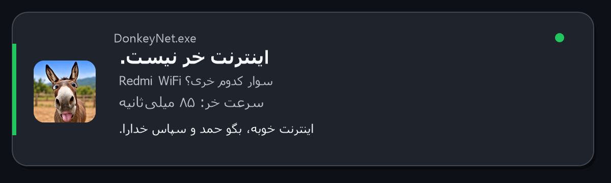
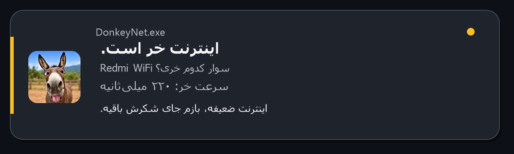
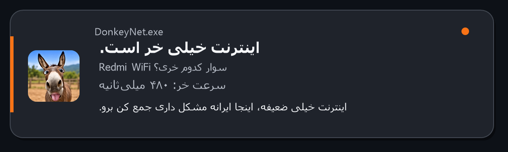
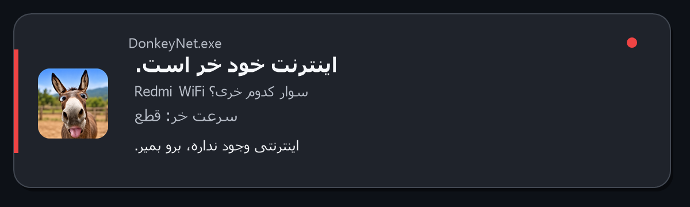

<div dir="rtl" align="center">


# DonkeyNet — اینترنت‌سنج خر

**یک اینترنت‌سنج شوخ‌طبع، بسیار سبک و همیشه‌فعال برای ویندوز**


[**دریافت مستقیم آخرین نسخهٔ DonkeyNet.exe**](https://github.com/sedwna/DonkeyNet/releases/latest/download/DonkeyNet.exe)

</div>

---

<div dir="rtl">

DonkeyNet کنار ساعت ویندوز می‌ماند، هر ۱۰ ثانیه کیفیت اتصال را می‌سنجد و فقط وقتی لازم باشد با یکی از چهار پیام زیر خبر می‌دهد. بدون نصب، بدون تبلیغ و بدون ارسال اطلاعات.

## تصاویر وضعیت‌ها

<table>
  <tr>
    <td width="50%"></td>
    <td width="50%"></td>
  </tr>
  <tr>
    <td align="center"><strong>اتصال خوب</strong></td>
    <td align="center"><strong>اینترنت ضعیف</strong></td>
  </tr>
  <tr>
    <td></td>
    <td></td>
  </tr>
  <tr>
    <td align="center"><strong>اینترنت خیلی ضعیف</strong></td>
    <td align="center"><strong>قطع کامل</strong></td>
  </tr>
</table>

## امکانات

- فایل اجرایی مستقل با حجم حدود **۲۷۵ کیلوبایت**
- نمایش آیکن اختصاصی در System Tray و اعلان‌های ویندوز
- نمایش نام Wi-Fi یا رابط شبکه با عبارت «سوار کدوم خری؟»
- نمایش پینگ با عنوان شوخ‌طبعانهٔ «سرعت خر»
- چهار وضعیت: خوب، ضعیف، خیلی ضعیف و قطع
- سنجش هر ۱۰ ثانیه با سه مقصد مستقل
- فیلتر نوسان لحظه‌ای با نیاز به دو نتیجهٔ مشابه پشت سر هم
- تکرار هشدار حداکثر هر ۱۰ دقیقه یا هنگام تغییر سطح
- اجرای خودکار با شروع ویندوز برای کاربر فعلی
- بررسی، دانلود و نصب سریع نسخهٔ جدید از داخل منوی برنامه
- منوی راست‌کلیک برای بررسی فوری، تنظیم Startup و خروج
- بدون Telemetry، حساب کاربری یا جمع‌آوری اطلاعات

## اجرا

۱. فایل [`dist/DonkeyNet.exe`](dist/DonkeyNet.exe) را دانلود و اجرا کنید.
۲. برنامه بدون بازکردن پنجره، کنار ساعت ویندوز قرار می‌گیرد.
۳. برای بررسی فوری روی آیکن دوبار کلیک کنید یا از منوی راست‌کلیک گزینهٔ «بررسی همین حالا» را بزنید.

> چون فایل امضای دیجیتال تجاری ندارد، ممکن است SmartScreen در اولین اجرا هشدار بدهد. در این حالت `More info` و سپس `Run anyway` را انتخاب کنید.

برنامه در اولین اجرا، Startup همان کاربر را فعال می‌کند. پس از اولین اجرا فایل EXE را جابه‌جا نکنید؛ یا ابتدا Startup را از منوی برنامه خاموش کنید.

## به‌روزرسانی سریع

از منوی راست‌کلیک آیکن، گزینهٔ **«بررسی برای به‌روزرسانی»** را انتخاب کنید. برنامه آخرین GitHub Release را بررسی می‌کند؛ اگر نسخهٔ جدیدی وجود داشته باشد، آن را مستقیماً دانلود می‌کند، صحت فایل را با SHA-256 می‌سنجد، نسخهٔ فعلی را جایگزین و خودش را دوباره اجرا می‌کند.

اگر آخرین نسخه را داشته باشید، همان‌جا پیام «برنامه به‌روز است» نمایش داده می‌شود.

## سطح‌بندی اتصال

| وضعیت | معیار پیش‌فرض |
|---|---|
| خوب | پینگ کمتر از ۱۸۰ میلی‌ثانیه و بدون خطا |
| خر است | پینگ ۱۸۰ میلی‌ثانیه یا یک خطا از سه سنجش |
| خیلی خر است | پینگ ۳۵۰ میلی‌ثانیه یا دو خطا از سه سنجش |
| خود خر است | پینگ ۷۰۰ میلی‌ثانیه یا قطع کامل |

اگر شبکه ICMP را مسدود کرده باشد، برنامه برای جلوگیری از تشخیص اشتباهِ قطعی، اتصال TCP را نیز بررسی می‌کند.

## ساخت از سورس

روی Windows PowerShell اجرا کنید:

```powershell
.\build.ps1
```

اسکریپت ساخت از کامپایلر داخلی .NET Framework ویندوز استفاده می‌کند و آیکن چنداندازهٔ ۱۶ تا ۲۵۶ پیکسل را داخل EXE قرار می‌دهد؛ نصب SDK یا پکیج جداگانه لازم نیست.

برای بازسازی تصاویر README:

```powershell
.\docs\generate-status-images.ps1
```

## ساختار پروژه

```text
DonkeyNet.cs                       کد اصلی برنامه
VERSION                            شمارهٔ آخرین نسخهٔ منتشرشده
build.ps1                          ساخت فایل اجرایی و آیکن ویندوز
assets/donkey-icon.png             لوگوی برنامه
docs/generate-status-images.ps1    سازندهٔ تصاویر وضعیت
docs/images/                       تصاویر README
dist/DonkeyNet.exe                 نسخهٔ آمادهٔ اجرا
dist/DonkeyNet.exe.sha256          هش صحت فایل به‌روزرسانی
dist/DonkeyNet.ico                 آیکن چنداندازهٔ ویندوز
```

</div>
